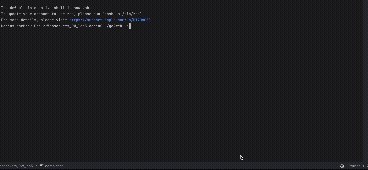

# go2web

A command-line HTTP client built from scratch using raw TCP sockets. No HTTP libraries — just `socket` + `ssl` for networking and `BeautifulSoup` for HTML parsing.

## Features

- **Raw HTTP/HTTPS requests** via TCP sockets — no `requests`, no `urllib`, no `http.client`
- **Search engine integration** using DuckDuckGo — returns top 10 results
- **Interactive result navigation** — pick a search result number to open it
- **Automatic redirect following** (301, 302, 303, 307, 308)
- **HTTP caching** with ETag and Last-Modified support (conditional GET with `If-None-Match` / `If-Modified-Since`)
- **Content negotiation** — sends `Accept: application/json, text/html` and renders each appropriately

## Setup

```bash
# clone the repo
git clone <your-repo-url>
cd go2web

# install dependencies
pip install -r requirements.txt

# make executable
chmod +x go2web
```

## Usage

```bash
./go2web -h                          # show help
./go2web -u <URL>                    # fetch a URL and print human-readable response
./go2web -s <search-term>            # search and show top 10 results
```

### Examples

```bash
# Fetch a website
./go2web -u https://example.com

# Fetch a JSON API (content negotiation)
./go2web -u https://api.github.com/repos/torvalds/linux

# Search for something
./go2web -s "python socket programming"

# Multi-word search
./go2web -s how to make pancakes
```

## Demo

<!-- Replace this with your actual gif -->


### Fetching a webpage

```
$ ./go2web -u https://example.com
Fetching: https://example.com
  [redirect 301 -> https://www.example.com/]

Example Domain
This domain is for use in illustrative examples in documents...
```

### Search with interactive navigation

```
$ ./go2web -s "python sockets"
Searching for: "python sockets"

Top 10 results:

  1. Socket Programming in Python (Guide) – Real Python
     https://realpython.com/python-sockets/

  2. socket — Low-level networking interface — Python docs
     https://docs.python.org/3/library/socket.html
  ...

Enter a result number to open it, or 'q' to quit:
> 1
Fetching: https://realpython.com/python-sockets/
------------------------------------------------------------
...page content...
```

### JSON content negotiation

```
$ ./go2web -u https://api.github.com/repos/torvalds/linux

[Content-Type: JSON]

{
  "id": 2325298,
  "name": "linux",
  "full_name": "torvalds/linux",
  ...
}
```

### HTTP caching

```
$ ./go2web -u https://example.com    # first request — fetched from server
$ ./go2web -u https://example.com    # second request — uses cache if 304
  [cache hit for example.com/]
```

## Project Structure

```
├── go2web          # executable shell wrapper
├── go2web.py       # main Python script (all logic here)
├── requirements.txt
└── README.md
```

## How It Works

1. **Raw TCP sockets**: Opens a `socket.socket`, wraps it with `ssl` for HTTPS, and manually writes `GET ... HTTP/1.1\r\n` onto the wire
2. **Response parsing**: Splits raw bytes into headers + body, handles chunked transfer encoding
3. **Redirects**: Checks for 3xx status codes and follows the `Location` header (up to 10 hops)
4. **Caching**: Stores responses on disk with ETag/Last-Modified metadata; uses conditional GET headers on repeat requests
5. **Content negotiation**: Sends `Accept: application/json, text/html` — JSON responses get pretty-printed, HTML gets stripped to readable text via BeautifulSoup
6. **Search**: Queries DuckDuckGo's HTML endpoint, parses result links, and lets you navigate them interactively